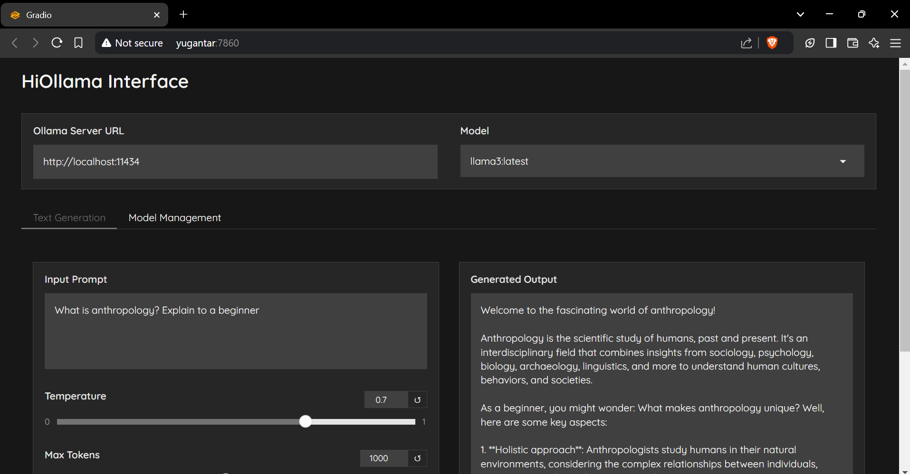

# HiOllama 🦙

A sleek and user-friendly interface for interacting with Ollama models, built with Python and Gradio.


## 🌟 Features

- 🚀 Simple and intuitive web interface
- 🔄 Real-time text generation
- 🎨 Adjustable parameters (temperature, max tokens)
- 📦 Model management capabilities
- 🎯 Support for multiple Ollama models
- 🔌 Custom server URL configuration

## 🖼️ Snapshot



## 🔧 Prerequisites

- Python 3.8 or higher
- Ollama installed and running
- Available models:
  - llama3
  - codestral
  - phi3

## 📥 Installation

1. Clone the repository:
```bash
git clone https://github.com/smaranjitghose/HiOllama.git
cd HiOllama
```

2. Create and activate virtual environment:
```bash
# Windows
python -m venv env
.\env\Scripts\activate

# Linux/Mac
python3 -m venv env
source env/bin/activate
```

3. Install required packages:
```bash
pip install -r requirements.txt
```

4. Install Ollama if you haven't already:
```bash
# Linux/Mac
curl -fsSL https://ollama.ai/install.sh | sh

# For Windows, install WSL2 first, then run the above command
```

## 🚀 Usage

1. Start the Ollama service:
```bash
ollama serve
```

2. Run HiOllama:
```bash
python main.py
```

3. Open your browser and navigate to:
```
http://localhost:7860
```

## 💡 Quick Start Guide

1. Select a model from the dropdown menu
2. Enter your prompt in the text area
3. Adjust temperature and max tokens if needed
4. Click "Generate" to get the response
5. Use the "Model Management" tab to pull new models

## ⚙️ Configuration

Default settings can be modified in `main.py`:

```python
DEFAULT_OLLAMA_URL = "http://localhost:11434"
DEFAULT_MODEL_NAME = "llama3"
```

## 🛠️ Troubleshooting

### Common Issues

1. **Connection Error**
   - Ensure Ollama is running (`ollama serve`)
   - Check if the server URL is correct
   - Verify port 11434 is accessible

2. **Model Not Found**
   - Pull the model first: `ollama pull model_name`
   - Check available models: `ollama list`

3. **Port Conflict**
   - Change the port in `main.py`:
     ```python
     app.launch(server_port=7860)  # Change to another port
     ```

## 🤝 Contributing

Contributions are welcome! Please feel free to submit a Pull Request.

1. Fork the project
2. Create your feature branch (`git checkout -b feature/AmazingFeature`)
3. Commit your changes (`git commit -m 'Add some AmazingFeature'`)
4. Push to the branch (`git push origin feature/AmazingFeature`)
5. Open a Pull Request

## 📝 License

This project is licensed under the MIT License - see the [LICENSE](LICENSE) file for details.

---
Made with ❤️ by [Smaranjit Ghose](https://github.com/smaranjitghose)